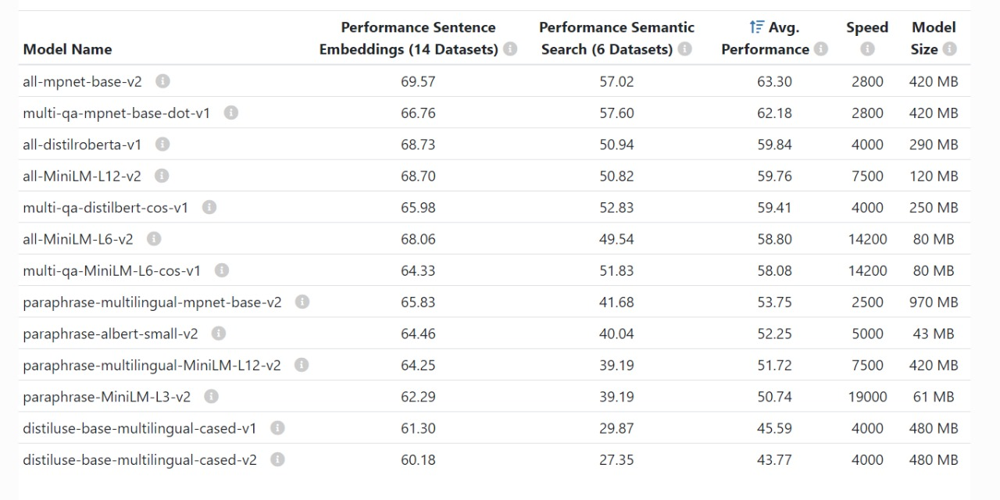

# Semantic Search For Electronic Products

## Project Overview

This project focuses on creating a semantic search engine for an electronic products dataset, aiming to improve search accuracy through semantic understanding of queries. It utilizes the sentence_transformers model multi-qa-MiniLM-L6-cos-v1 to generate advanced vector embeddings for query analysis. The project leverages Qdrant for data storage and Gradio for an intuitive user interface. The service allows users to input a search query and retrieves the most relevant results based on semantic similarity.

## Prerequisites

1. **Docker Desktop**
   - Download and install Docker Desktop from [here](https://www.docker.com/products/docker-desktop/).Please choose the download version based on your operating system.
   - Follow the installation instructions for your operating system.
   - Start Docker Desktop and ensure it is running.

2. **Qdrant Docker Container**
   - Pull the Qdrant Docker image:
     ```bash
     docker pull qdrant/qdrant
     ```
   - Run the Qdrant container:
     ```bash
     docker run -p 6333:6333 -v .:/qdrant/storage qdrant/qdrant
     ```

## Files and Their Roles

- **requirements.txt**: Lists all the Python package dependencies required to run the project. It ensures that the correct versions of libraries such as pandas, sentence-transformers, qdrant-client, numpy, gradio, and torch are installed.

- **src/text_processing_utils.py**: Contains utility functions for text processing. `remove_p_tags` removes HTML `<p>` tags from descriptions, and `generate_embeddings` generates embeddings for a list of strings using a SentenceTransformer model. This file plays a crucial role in preprocessing text data before indexing and searching.

- **src/data_preparation_and_indexing.py**: Handles data preparation and indexing in the Qdrant database. It reads and preprocesses data from a CSV file, generates embeddings for the preprocessed data, and uploads these embeddings along with their associated texts to a Qdrant collection. This script is essential for initializing the Qdrant database with searchable content.

- **src/semantic_search_service.py**: This is the main entry point of the application. It defines a Gradio interface for users to input search queries. Under the hood, it uses the `search_query` function to find the nearest embeddings in the Qdrant database and formats the results for display.

## How the Code Runs

- **Data Preparation and Indexing**: Before running the semantic search service, the `data_preparation_and_indexing.py` script is executed to read data from a CSV file, preprocess it (including removing HTML tags and generating embeddings), and upload it to a Qdrant collection. This step is crucial for setting up the database with searchable content.

- **Launching the Semantic Search Service**: Running `semantic_search_service.py` starts the Gradio web interface. Users can enter search queries, which are then processed to generate embeddings using the same model specified in `text_processing_utils.py`. These query embeddings are used to search the Qdrant database for the nearest neighbors (most semantically similar entries).

- **How It Works**: When a search query is submitted, `semantic_search_service.py` calls `generate_embeddings` from `text_processing_utils.py` to convert the query into an embedding. It then searches the Qdrant database for the closest embeddings using this query embedding, leveraging cosine similarity to find the most similar matches. The top 5 similar products, based on the highest cosine similarity scores to the query embedding, are selected and formatted as output. These results are then displayed to the user through the Gradio interface.


## Running the Project
0. **Clone the Repository:**
   Before starting with the project setup, clone the repository to your local machine using:
   ```bash
   git clone https://github.com/kartikml/Semantic_search_for_Electronic_products.git
   ```
   Navigate into the project directory:
      ```bash
      cd Semantic_search_for_Electronic_products
      ```

1. **Create a virtual environment:**
   ```bash
   python -m venv env
   ```
2. **Activate the virtual environment:**
   - On Windows:
     ```bash
     env\Scripts\activate
     ```
   - On macOS and Linux:
     ```bash
     source env/bin/activate
     ```
3. **Install the required dependencies:**
   ```bash
   pip install -r requirements.txt
   ```
   **Models Available with SBERT**
   Here is an overview of various models available with SBERT, their performance metrics, and characteristics:
   
4. **Understanding the Default Model for Embeddings:**
   The default model used for creating embeddings is `multi-qa-MiniLM-L6-cos-v1`, which is specifically tuned for semantic search. This model is similar to `all-MiniLM-L6-v2` as they both are based on the same underlying MiniLM architecture. However, `multi-qa-MiniLM-L6-cos-v1` is optimized for semantic search tasks, offering a balance between speed and accuracy. The choice of these models was driven by their efficiency in processing and their relatively smaller size, making them ideal for quick and responsive semantic search applications.

   - **Using the Default Model:**
     First, navigate to the `src` directory:
     ```bash
     cd src
     ```
     To use the default model for preparing and indexing your data, and for launching the semantic search service, follow these commands:
     ```bash
     python data_preparation_and_indexing.py --file_path=<path_to_csv>
     ```
     Launch the semantic search service:
     ```bash
     python semantic_search_service.py
     ```

   - **Using a Different Model:**
     First, navigate to the `src` directory:
     ```bash
     cd src
     ```
     If you wish to use a different model, such as `sentence-transformers/all-MiniLM-L6-v2`, you can specify the model name using the `--model_name` argument as shown below:
     ```bash
     python data_preparation_and_indexing.py --file_path=<path_to_csv> --model_name sentence-transformers/all-MiniLM-L6-v2
     ```
     Launch the semantic search service:
     ```bash
     python semantic_search_service.py --model_name sentence-transformers/all-MiniLM-L6-v2
     ```

5. **Open the provided URL in a web browser to interact with the Gradio interface and perform semantic searches.**

## Note on Model Size and Computational Requirements

When selecting larger and more computationally intensive models, such as `paraphrase-multilingual-mpnet-base-v2`, it is essential to have access to a computer with significant computational power. The size and complexity of these models can result in timeout errors on systems with limited processing capabilities. To avoid potential performance issues, ensure your hardware is sufficiently robust to accommodate such demanding models.

